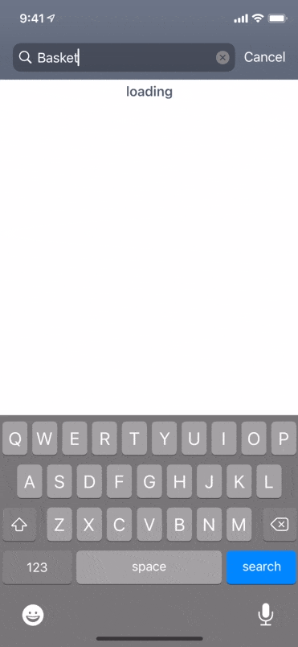
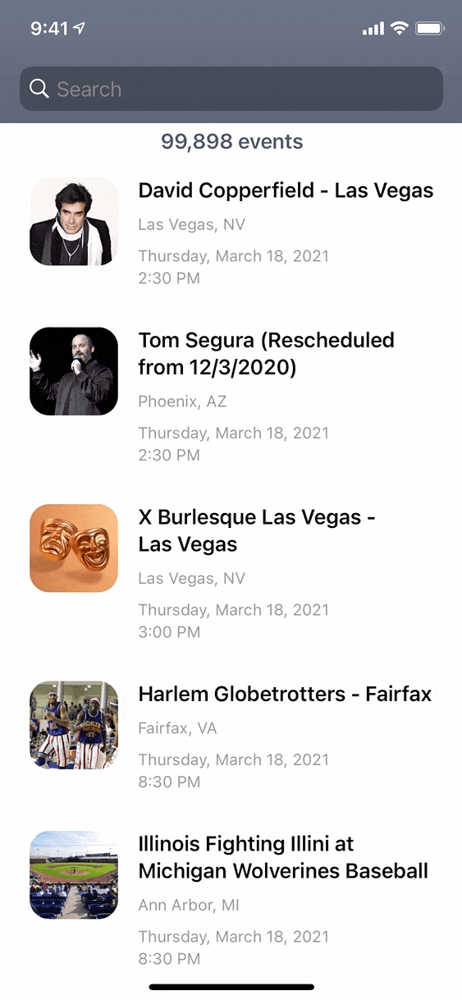

## Seat Geek Coding Exercise

---
## Requirements 

- [x] Write your application for Native iOS Platform preferably with Swift **(used Storyboards and UIKit)**
- [x] Favorited events are persisted between app launches **(used UserDefaults)**
- [x] Events are searchable through SeatGeek API **(see known issues)**
- [ ] Unit tests are preferable **(haven't taught myself unit testing yet but found [this](https://www.hackingwithswift.com/articles/94/how-to-refactor-your-app-to-add-unit-tests) resource to start)**
- [x] Third party libraries are allowed **(used Reachability by ashleymills, no CocoaPods for install simplicity)**
- [ ] Make sure that the application supports iOS 12 and above **(tested on simulator iPhone X iOS 12.1)**
- [x] The application must compile with Xcode 12.x.x **(used 12.4)**
- [x] Please add a README or equivalent documentation about your project

---
## Installation

1. Clone repo: https://github.com/philmodin/SeatGeekCodingExercise
2. Open: `SeatGeekCodingExercise.xcodeproj`
3. Set team and bundle ID.
4. Notice `InfoSeatGeek.plist` is missing. Ignore it and build project, this file will be auto generated.
5. Open `InfoSeatGeek.plist` If you have a client ID for Seat Geek, paste it here. Otherwise register for one at: https://seatgeek.com/account/develop
6. Attach device and run the project.
7. If needed, check trusted apps in iPhone device management settings for your developer profile.

---
## Known issues

- Massive view controllers
- Searching events using the `q` arguement produces unexpected results. For example searching "ba" returns less events than "bas"
